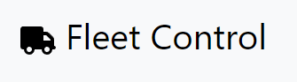
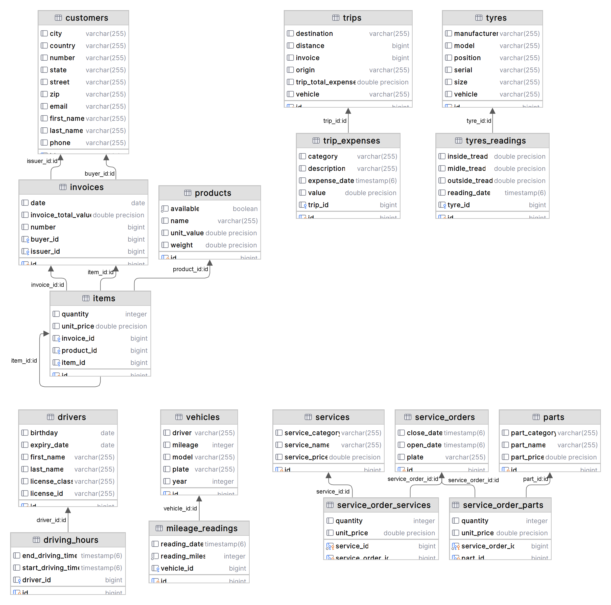
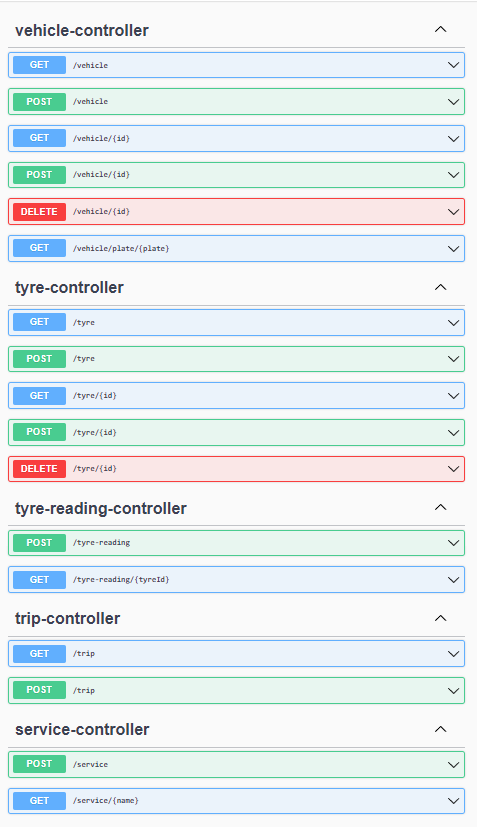
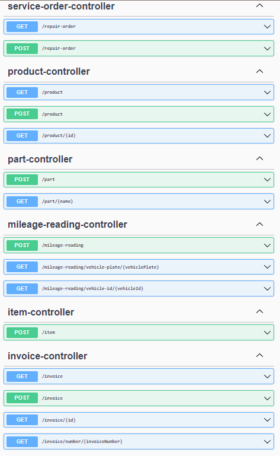
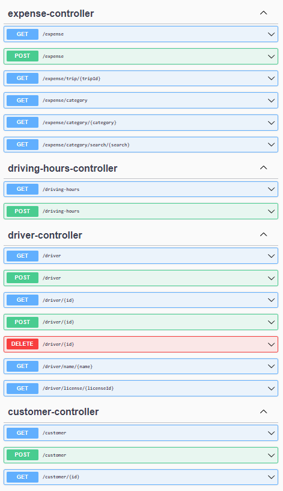

<h1 align="center">Fleet Control API</h1>

<p align="center">
  <a href="#-tecnologias">Tecnologias</a>&nbsp;&nbsp;&nbsp;|&nbsp;&nbsp;&nbsp;
  <a href="#-projeto">Projeto</a>&nbsp;&nbsp;&nbsp;|&nbsp;&nbsp;&nbsp;
  <a href="#-documentação-da-api">Documentação</a>&nbsp;&nbsp;&nbsp;|&nbsp;&nbsp;&nbsp;
  <a href="#-licença">Licença</a>
</p>

<br>

<p align="center">
  
</p>

## 🚀 Tecnologias

| Tecnologia                                                                                                           | Funcionalidade                                                                                                                              |
|----------------------------------------------------------------------------------------------------------------------|---------------------------------------------------------------------------------------------------------------------------------------------|
|             | linguagem utilizada de forma básica e avançada para estruturas de decisão e repetição, orientação a objetos e mapeamento objeto-relacional. |
|  | como fonte de dados, fazendo uso da linguagem SQL para persistência dos dados.                                                              |
|          | framework para construção de uma API REST completa e funcional.                                                                             |
|          | ferramenta para gerenciamento de pacotes e  copilação do código do projeto.                                                                 | 
|                   | versionamento de código em repositório local.                                                                                               |
|          | versionamento de código em repositório remoto.                                                                                              | 


## 💻 Projeto

Uma aplicação back-end para controle de frotas. Oferece endpoints de acesso das funcionalidades de cadastro de motoristas, veículos, viagens, despesas de viagens, pneus, notas fiscais, produtos, peças, serviços, ordens de serviço e clientes. É possível listar e editar os registros inseridos na aplicação.

## 💽 Banco de Dados

Diagrama de tabelas do projeto:

<p align="center">
  
</p>

## 📝 Documentação da API

Para implementação das funcionalidades foram desenvolvidos os seguintes endpoints:

<p align="center">
  
</p>

<p align="center">
  
</p>

<p align="center">
  
</p>

## 🚚 Veículos

### Inclusão de Veículo
```http
  POST /vehicle
```

```http
{
  "plate": "string",
  "model": "string",
  "driver": "string",
  "mileage": 0,
  "year": 0
}
```

### Listagem de Veículos
```http
  GET /vehicle
```
Retorna lista de veículos JSON.

### Consulta de Veículo
```http
  GET /vehicle/{id}
```

Retorna consulta do veículo informado através de JSON.

## 🎱 Pneus

### Inclusão de Pneu

```http
  POST /tyre
```
```http
{
  "manufacturer": "string",
  "serial": "string",
  "model": "string",
  "size": "string",
  "position": "string",
  "vehicle": "string"
}
```

### Listagem de Pneus

```http
  GET /tyre
```
Retorna lista de pneus através de JSON.


## 🌍 Viagens

### Inclusão de Viagem
```http
  POST /trip
```

```http
{
  "vehicle": "string",
  "origin": "string",
  "destination": "string",
  "distance": 0
}
```

### Listagem de Viagens
```http
  GET /trip
```
Retorna lista de viagens através de JSON.


## 🏃 Iniciando o Projeto
Primeiro clone este repositório remoto em sua máquina local:

[https://github.com/denisonkolling/fleet-control-api.git](https://github.com/denisonkolling/fleet-control-api.git)

Lembre-se de adicionar as dependências do projeto maven, o projeto inclui Open API Swagger UI.


Realize a configuração do seu banco de dados local em ```fleet-control/src/main/resources/application.properties```:

```bash
spring.datasource.url=${DB_URL}
spring.datasource.username=${DB_USERNAME}
spring.datasource.password=${DB_PASSWORD}
```
Inicie a aplicação em sua IDE de preferência.

Acesse [http://localhost:8080/swagger-ui/index.html](http://localhost:8080/swagger-ui/index.html) através de seu navegador para acessar a aplicação.

## 💹 Possíveis Melhorias

Como a aplicação está atualmente em estágio de protótipo funcional, podem ser aplicadas diversas melhorias ou criadas novas funcionalidades:
- Implementação de camadas de segurança para autenticação e autorização de usuários.
- Melhorias no tratamento de exceções.
- Melhorias no controle de kilometragem de veículos
